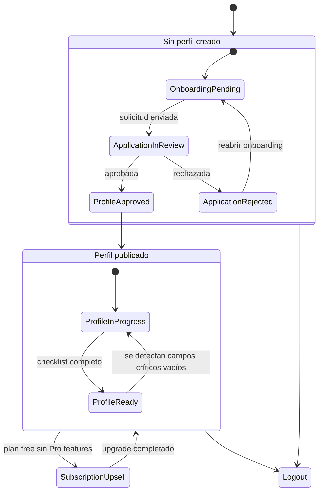

# Client dashboard state map

## Roles & flags
| Flag / campo | Fuente | Significado | Impacto en UI |
| --- | --- | --- | --- |
| `role` | `auth.users` + claims | Determina capacidades base (member, player, coach, admin). | Define menú inicial y accesos especiales. |
| `player_status` | `player_profiles.status` | `draft`, `pending_review`, `approved`, `rejected`. | Controla acceso a secciones de edición y CV público. |
| `plan` | `subscriptions.plan` (`plan` enum) | Plan vigente del jugador. | Habilita características premium (plantillas extra, multimedia ilimitada). |
| `has_active_application` | `player_applications` (`status` ∈ {`submitted`, `in_review`}) | Si el usuario tiene una solicitud de perfil en curso. | Muestra progress tracker y bloquea reenvío. |
| `profile_completed_ratio` | Derivado (campos obligatorios llenos / total) | Avance general del setup. | Alimenta badges, checklist y asistente. |
| `content_flags` | Configurable (`profile_sections_visibility`, `player_media`) | Qué bloques/medios están disponibles. | Determina toggles activos y alertas de contenido. |

## Flujo de navegación

## UI reacciones por estado
- **Sin perfil / sin solicitud** (`player_status` null, `has_active_application = false`)
  - Dashboard muestra hero con CTA "Crear perfil" que redirige al onboarding.
  - Menú: secciones de edición deshabilitadas con componente "Disponible cuando tu perfil sea aprobado".

- **Solicitud en curso** (`has_active_application = true`, `player_status` ∈ {`draft`, `pending_review`})
  - Card principal detalla etapa actual, fecha estimada de revisión y botón para ver seguimiento.
  - Checklist se limita a pasos previos (documentación, datos personales) y bloquea multimedia/plantilla.

- **Solicitud rechazada** (`player_status = rejected`)
  - Banner crítico con razones (`player_applications.rejection_reason`).
  - Acciones: "Revisar y reenviar" (lleva al onboarding) + contacto soporte.

- **Perfil aprobado** (`player_status = approved`)
  - Muestra progreso granular (datos personales, trayectoria, multimedia, plantilla) con contadores.
  - Habilita edición completa y CTA "Ver perfil público" (`/public/[slug]`).
  - Si `plan = free`, sección de suscripción destaca beneficios Pro y bloqueo de funcionalidades premium.

- **Plan Pro** (`plan` ∈ {`pro`, `pro_plus`})
  - Se habilitan plantillas adicionales, métricas avanzadas y capacidad extendida de multimedia.
  - Badge "Pro" junto a nombre + acceso a métricas (`profile_views`).

- **Flags de contenido faltante** (ej. sin highlights, sin fotos)
  - Cada pestaña muestra alertas contextuales usando HeroUI `Badge` + `Alert`.
  - El asistente sugiere la siguiente mejor acción en sidebar secundario.

## Asistente y checklist
- Crear `dashboard_tasks` (vista o tabla) que consolide tareas pendientes por jugador.
- El asistente prioriza tareas según impacto en visibilidad (ej. subir highlights antes que redes sociales).
- Las acciones completadas actualizan `profile_completed_ratio` y remueven badges de alerta.

## Eventos clave
| Evento | Disparador | Acción | Destino |
| --- | --- | --- | --- |
| `dashboard.application_created` | Fin de onboarding | Agendar revisión interna, mandar email. | Queue interno. |
| `dashboard.profile_unlocked` | `player_status` cambia a `approved` | Notificar usuario, habilitar menús. | Email + in-app banner. |
| `dashboard.section_completed` | Checklist se marca al 100% | Actualizar métricas de adopción. | Analytics. |
| `dashboard.plan_upgraded` | Stripe webhook | Mostrar toast éxito, recalcular límites. | UI + Supabase. |

Mantener esta matriz alineada con el roadmap para priorizar entregas incrementales.
